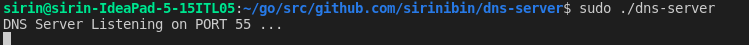
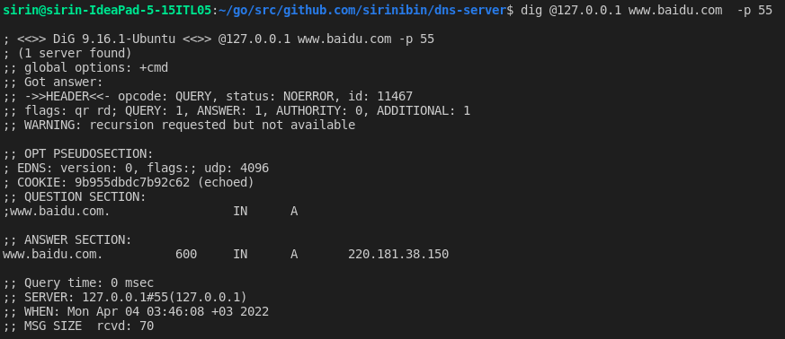
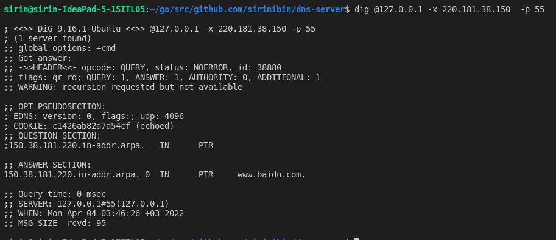

## How to Install & Run

### Install Golang:

Follow instructions on https://go.dev/doc/install

### Clone Source code & build:

`mkdir -p ~/go/src/github.com/sirinibin`

`cd ~/go/src/github.com/sirinibin`

`git clone git@github.com:sirinibin/dns-server.git`

`cd dns-server`

`go build`

### Start DNS Server:

`sudo ./dns-server`

## How to Test

`dig @127.0.0.1 www.baidu.com -p 55`

`dig @127.0.0.1 -x 220.181.38.150 -p 55`

